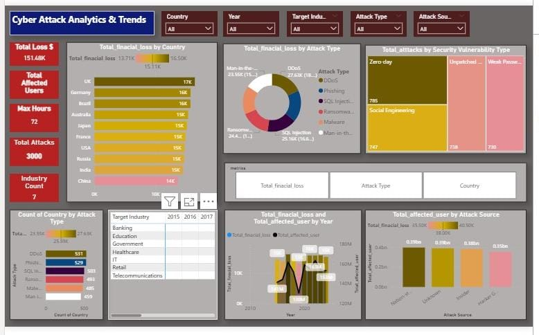

# Cyber Security Threat Dashboard

## 📊 Project Overview

This project presents a Power BI dashboard analyzing global cyber security threats from 2015–2024.

## 📁 Dataset

Global Cybersecurity Threats Dataset (Kaggle)

## 📌 Features

* Cyber attacks by country
* Attack types (Malware, Phishing, Ransomware)
* Industry wise attacks
* Year wise trend analysis

## 🛠 Tools Used

* Power BI
* Excel
* Data Visualization

## 📷 Dashboard Preview

Power BI interactive dashboard showing cyber security attack trends worldwide.

## 👨‍💻 Author

Gaurav Bhausaheb Kadam
B.Tech AIML Student
Sanjivani University Kopargaon

## Dashboard Preview

